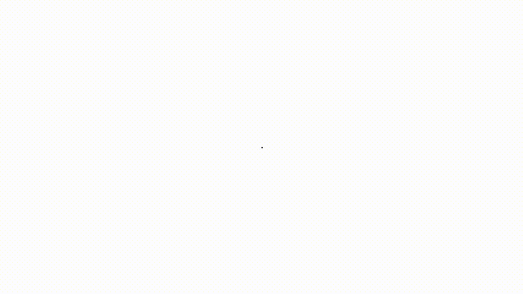
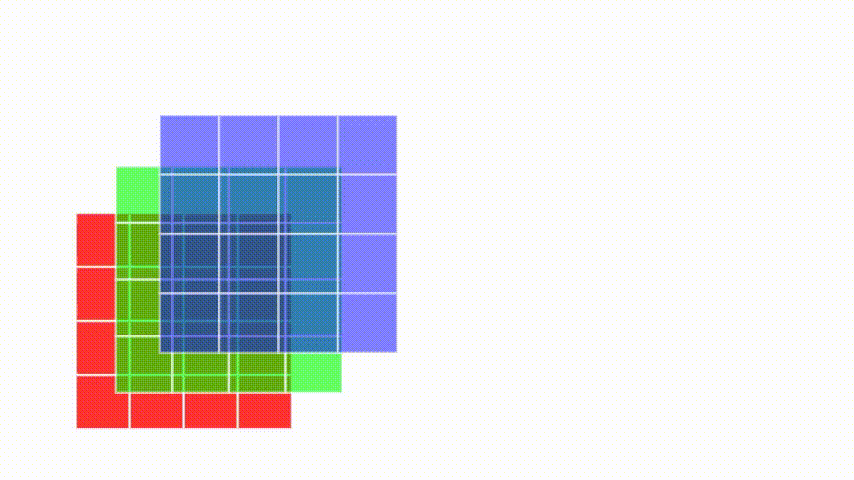

# Cnn Cheatsheet
animations for visualizing operations in CNNs

# 1D Convolution

# 2D Convolution

## Zero Padding

## Valid Convolution

## Same Convolution

## Strided Convolution

## Strided 1 and Stride 2

## Pooling

## MNIST Convolution

## RGB Convolution

## RGB to Volume

## Volume to Volume

## 1x1 Convolution

## Global Pooling

## Transpose Convolution

